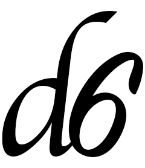

```{r setup, include=FALSE}
set.seed(42)
knitr::opts_chunk$set(cache = FALSE, collapse = TRUE, comment = "#>")
library(distr6)
```

# distr6 

[](https://travis-ci.com/alan-turing-institute/distr6)
[](https://ci.appveyor.com/project/RaphaelS1/distr6-xsr0j/branch/master)
[](https://img.shields.io/badge/lifecycle-maturing-blue.svg)
[](http://www.r-pkg.org/badges/version/distr6)
[](https://codecov.io/gh/alan-turing-institute/distr6)
[](https://opensource.org/licenses/MIT)

## What is distr6?

distr6 is a unified and clean interface to organise the hundreds of probability distributions implemented in R into one R6 object oriented package.

Our short-term aims are to implement all distributions in the R stats package as well as some other commonly utilised distributions. We also allow for user-defined probability distributions/families via multiple inheritance. Building the package from the ground up and making use of tried and tested design patterns (as per Gamma et al. 1994), distr6 aims to be the only package needed for probability distributions in R.

distr6 extends the work of Peter Ruckdeschel, Matthias Kohl et al. who created the first object-oriented (OO) interface for distributions using S4. Their [distr package](http://distr.r-forge.r-project.org/) is currently the gold-standard in R for OO distribution handling. Using R6 we aim to take this even further and to create a scalable interface that can continue to grow with the community. Full details of the API and class structure can be seen in the project [wiki page](https://github.com/alan-turing-institute/distr6/wiki) and the [distr6 website](https://alan-turing-institute.github.io/distr6/).


## Main Features

distr6 is not intended to replace the base R distributions function but instead to give an alternative that focuses on distributions as objects that can be manipulated and accessed as required. The main features therefore centre on OOP practices, design patterns and API design. Of particular note:
* All distributions in base R introduced as objects with methods for common statistical functions including pdf, cdf, inverse cdf, simulation, mean, variance, skewness and kurtosis

```{r binomial}
B <- Binomial$new(prob = 0.5, size = 10)
B$pdf(1:10)
B$kurtosis()
B$rand(5)
summary(B)
```

* Flexible construction of distributions for common parameterisations

```{r parameters}
Exponential$new(rate = 2)
Exponential$new(scale = 2)
Normal$new(mean = 0, prec = 2)
Normal$new(mean = 0, sd = 3)$parameters()
```

* Decorators for extending functionality of distributions to more complex modelling methods

```{r decorators}
B <- Binomial$new()
decorate(B, ExoticStatistics)
B$survival(2)
decorate(B, CoreStatistics)
B$kthmoment(6)
```

* S3 compatibility to make the interface more flexible for users who are less familiar with OOP

```{r s3}
B <- Binomial$new()
mean(B) # B$mean()
var(B) # B$var()
cdf(B, 2:5) # B$cdf(2:5)
```

* Wrappers including truncation and huberization for distribution manipulation and including product/joint distributions for distribution composition

```{r wrappers}
B <- Binomial$new()
TruncatedDistribution$new(B, lower = 2, upper = 5) #Or: truncate(B,2,5)
N <- Normal$new()
MixtureDistribution$new(list(B,N), weights = c(0.1, 0.9))
ProductDistribution$new(list(B,N))
```

* Additionally we introduce a SetSymbol class for a purely symbolic representation of sets for Distribution typing

```{r sets}
Binomial$new()$type()
Binomial$new()$support()
Binomial$new()$distrDomain()
Set$new(1:5)
Interval$new(1,5)
PosReals$new()
```


## Usage

distr6 has three primary use-cases:

1. **Upgrading base** Extend the R distributions functions to classes so that each distribution additionally has basic statistical methods including expectation and variance and properties/traits including discrete/continuous, univariate/multivariate, etc.
1. **Statistics** Implementing decorators and adaptors to manipulate distributions including distribution composition. Additionally functionality for numeric calculations based on any arbitrary distribution.
1. **Modelling** Probabilistic modelling using distr6 objects as the modelling targets. Objects as targets is an understood ML paradigm and introducing distributions as classes is the first step to implementing probabilistic modelling.

## Installation

Before publication to CRAN, the latest stable release is available via:
```{r eval=FALSE}
remotes::install_github("alan-turing-institute/distr6", dependencies = TRUE)
```


## Package Development and Contributing

distr6 is now public on GitHub but developments will continue to be made internally by a team of researchers from UCL working at The Alan Turing Institute. All contributions are released under the [MIT licence](https://opensource.org/licenses/MIT) with acknowledgements to the [LGPL-3 licence of distr](https://github.com/alan-turing-institute/distr6/blob/master/Licensing). We welcome external contributors to test our API and notify us of bugs and issues however we are not currently looking for feature requests as the API is still in development. See our [roadmap](https://alan-turing-institute.github.io/distr6/articles/roadmap.html) for short- and long-term plans. Before raising an issue please read through our [contributing guidelines](https://github.com/alan-turing-institute/distr6/blob/master/CONTRIBUTING.md) for details including our [code of conduct](https://github.com/alan-turing-institute/distr6/blob/master/CODE_OF_CONDUCT.md).

## Acknowledgements

distr6 is the result of a collaboration between many people, universities and institutions across the world, without whom the speed and performance of the package would not be up to the standard it is. Firstly we acknowledge all the work of Prof. Dr. Peter Ruckdeschel and Prof. Dr. Matthias Kohl in developing the original distrXXX family of packages. Secondly their signficiant contributions to the planning and design of distr6 including the distribution and probability family class structures. A team of undergraduates at University College London implemented many of the probability distributions, designed the plotting interface and are currently in the process of implementing these desgins. The team consists of Shen Chen (@ShenSeanChen), Jordan Deenichin (@jdeenichin), Chengyang Gao (@garoc371), Chloe Zhaoyuan Gu (@gzy823), Yunjie He (@RoyaHe), Xiaowen Huang (@w090613), Shuhan Liu (@shliu99), Runlong Yu (@Edwinyrl), Chijing Zeng (@britneyzeng) and Qian Zhou (@yumizhou47). We also want to thank Prof. Dr. Bernd Bischl for discussions about design choices and useful features. Finally University College London and The Alan Turing Institute for hosting workshops, meetings and providing coffee whenever needed.
